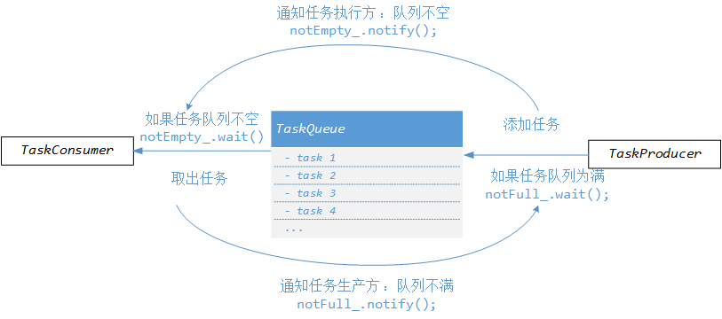

# 线程

### 1. 有界·线程安全队列 ***BoundedBlockingQueue*** 
```cpp
    template<typename T>
    class BoundedBlockingQueue : boost::noncopyable {
    public:
        explicit 
        BoundedBlockingQueue(int maxSize) ;

        void put(const T& x) ;

        T take() ;

        bool empty() const ;

        bool full() const ;

        size_t size() const ;

        size_t capacity() const;

    private:
        mutable MutexLock          mutex_;
        Condition                  notEmpty_;
        Condition                  notFull_;
        boost::circular_buffer<T>  queue_;
    };
```
这个环形缓冲队列，有两个`条件量`：`notEmpty_`，`notFull_`。
+ `notEmpty_`：在`pull`函数完成任务添加后，通知执行任务`notEmpty_.notify()`。
+ `notFull_`：在`take()`函数执行完任务后，通知线程可以继续添加任务了`notFull_.notify()`。  
如图：   

这个类实现了线程安全的`queue`，内部封装了`Condition`、`Mutex`，使得完成任务可以内部有条不紊的进行。
### 2. 无界·线程安全队列 ***BlockingQueue***
由于无界，因此每次`put`添加数据时候不必考虑队列缓冲区是否满了。其余的大体和上面的有界线程安全队列一致。
```cpp
    template<typename T>
    class BlockingQueue : boost::noncopyable {
    public:
        explicit 
        BlockingQueue(int maxSize) ;

        void put(const T& x) ;

        T take() ;

        bool empty() const ;

        size_t size() const ;

        size_t capacity() const;

    private:
        mutable MutexLock          mutex_;
        Condition                  notEmpty_;
        std::deque<T>              queue_;
    };
```
###  3. 线程池  ***ThreadPool***
```cpp
    class ThreadPool : boost::noncopyable {
    public:
        typedef std::function<void ()> Task;

        explicit 
        ThreadPool(const string& name = string());
        ~ThreadPool();

        //启动线程数
        void start(int numThreads);
        void stop();
        void run(const Task& f);

    private:
        void runInThread();
        Task take();

        MutexLock mutex_;
        Condition cond_;
        string name_;
        boost::ptr_vector<muduo::Thread> threads_; 
        std::deque<Task> queue_; // 任务队列
        bool running_;
    };
```
+ 线程池的线程个数固定。
+ 线程执行流程  
    + 执行任务   
    `start`启动`numThreads`个数量的线程，并且创建的同时，执行`runThreads`函数，`runThreads`内部是通过`take()`来获取任务，如果此时任务队列为空，就会一直`wait`，等待任务的到来。
    + 添加任务  
    `run`函数作用是将任务添加到队列中，然后`notify`通知线程来执行任务。

### 4. 线程安全的单例类 ***Singleton***
+ `pthread_once`
    ```c
        #include<pthread>
        
        int pthread_once(pthread_once_t *once_control, void (*init_routine)(void));
        
        pthread_once_t once_control = PTHREAD_ONCE_INIT;
    ```
这个函数`pthread_once`可以使得`init_routine`函数仅仅执行一次，而且是线程安全的，因此可以用来实现线程安全的单例类。
+ `atexit`
    ```c
       #include <stdlib.h>

       int atexit(void (*function)(void));
    ```
    可以注册一个函数，在**调用进程终止时**调用。对于单例类可以注册一个`destroy`函数，在进程退出时析构唯一的对象。

### 5. 线程特定数据 ***ThreadLocal***
线程特定数据类型需要借助一组 *Linux* 函数。
```c
    #include <pthread.h>

    int pthread_key_create(pthread_key_t *key, void (*destructor)(void*));
    int pthread_setspecific(pthread_key_t key, const void *value);
    void *pthread_getspecific(pthread_key_t key);
```
对其进行封装得到 ***`ThreadLocal<T>`*** ，使得每个线程都有类型 ***T*** 变量，但是变量具体的值在不同的线程不同。对于`POD`数据类型，可以用`__thread`实现，对于非`POD`数据类型，就需要借组**线程特定数据类型**实现一个类`ThreadLocal`。
```cpp
    template<typename T>
    class ThreadLocal : boost::noncopyable {
    public:
        ThreadLocal();
        ~ThreadLocal();

        T& value();        
    private:
        static void destructor(void * arg);
        pthread_key_t pkey_;
    };
```
类 ***`ThreadLocal<T>`*** 本质上只是实现类型 ***`T`*** 的一个实例的线程局部化，***`ThreadLocal<T>`*** 对象应该和 ***`T`*** 一样使用。函数 `value()`就是为实现创建`T`一个实例 ***`ThreadLocal<T> obj`*** 。在每个线程中，要想使用`obj`都需要调用`value()`函数，那么每次都`new`了一个值，存储在`pkey`处。

### 6.  ***ThreadLocalSingleton*** 
***ThreadLocalSingleton<T>*** 实现的每个线程只有类型 ***T*** 的一个实例对象。

+ 另一个种实现方式  
    ***`Singleton<ThreadLocal<T>>`***，如此，整个进程只有类型 ***`ThreadLocal<T>`*** 的一个实例对象，但是每个线程类型 ***`T`*** 的对象不同，也是只有一个。这是因为:  
    ```cpp
        T& ThreadLocal::value() {            
            T* perThreadValue = static_cast<T*>(pthread_getspecific(pkey_));
            if (!perThreadValue) {
                T* newObj = new T();
                pthread_setspecific(pkey_, newObj); 
                perThreadValue = newObj;
            }
            return *perThreadValue;
        }
    ```
    由于只有一个 ***`ThreadLocal<T>`*** 的一个实例对象，假设是`to`，那么`to`的`pkey`在整个进程共享，但是由线程特定数据类型可知，键相同，值可以不同。
+ ***`ThreadLocalSingleton<T>`*** 
    ```cpp
    template<typename T>
    class ThreadLocalSingleton : boost::noncopyable {
    public:
        static T& instance();
        static T* pointer();

    private:
        static void destructor(void* obj);

        class Deleter {
        public: 
            pthread_key_t pkey_;
            ...
        };
        static __thread T* t_value_;
        static Deleter deleter_;
    };
    ```
    + `instance()`用于生成实例，`pointer()`返回实例的地址。  
    + 类 *`Deleter`* 
        + 是用来析构实例，具体的析构函数由`destructor()`函数实现，这个主要是为了方便实例自动析构，不用手工干预。
        
            ***`ThreadLocalSingleton`*** 对象 生命期结束时，其`static`成员变量`deleter`也会析构，同时会调用`destructor()`析构类型 ***`T`*** 的对象。
        + 在 *`Deleter`* 种用线程特定数据类型实现`ThreadLocal`
    